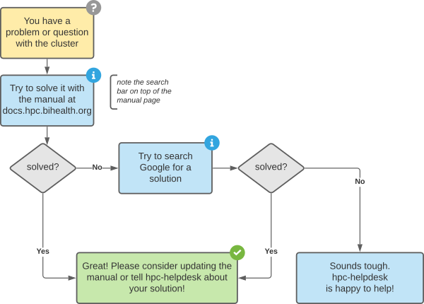

# How-To: Write a Good Ticket

!!! info "Can you solve the question yourself?"

    Please try to solve the question yourself with this manual and Google.

    {: style="width: 75%;" .center}

    If the problem turns out to be hard, we're happy to help.

This page describes how to write a good help request ticket.

1. Write a descriptive summary.
    - Which cluster are you on? HPC 4 Research or HPC 4 Clinic?
    - Put in a short summary into the Subject.
    - Expand on this in a first paragraph.
      Try to answer the following questions:
        - What are you trying to achieve?
        - When did the problem start?
        - Did it work before?
        - Which steps did you attempt to achieve this?
2. Give us your basic information.
    - Please give us your user name on the cluster.
3. Put enough details in the details section.
    - Please give us the exact commands you type into your console.
    - What are the symptoms/is the error message
4. Never put your password into the ticket.
   **In the case that you handle person-related data of patients/study participants, never write any of this information into the ticket or sequent email.**
5. Please do not send us screenshot images of what you did but copy and paste the text instead.

There is more specific questions for common issues given below.

## Problems Connecting to the Cluster

- From which machine/IP do you try to connect (`ifconfig` on Linux/Mac, `ipconfig` on Windows)?
- Did it work before?
- What is your user name?
- Please send us the output of `ssh-add -l` and add `-vvv` to the SSH command that fails for you.
- What is the response of the server?

## Problems Submitting Jobs

- Please give us the directory that you run things in.
- Please send us the submission script that you have problems with.
- If the job was submitted, Slurm  will give you a job ID.
  We will need this ID.
- Please send us the output of `scontrol show job <jobid>` or `sacct --long -j <jobid>` of your job.
