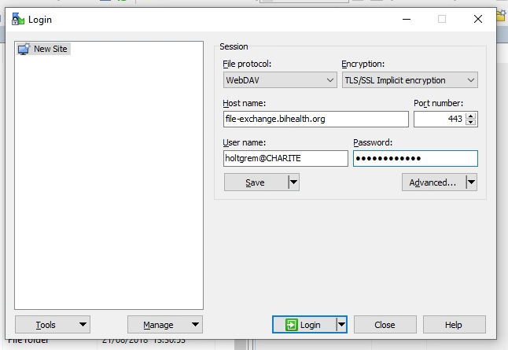
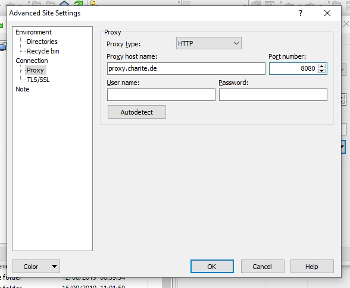
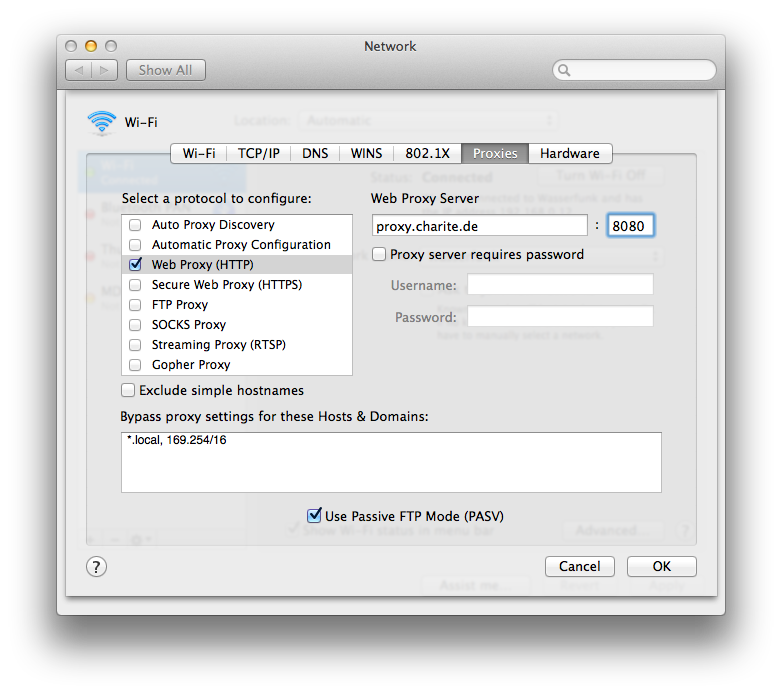
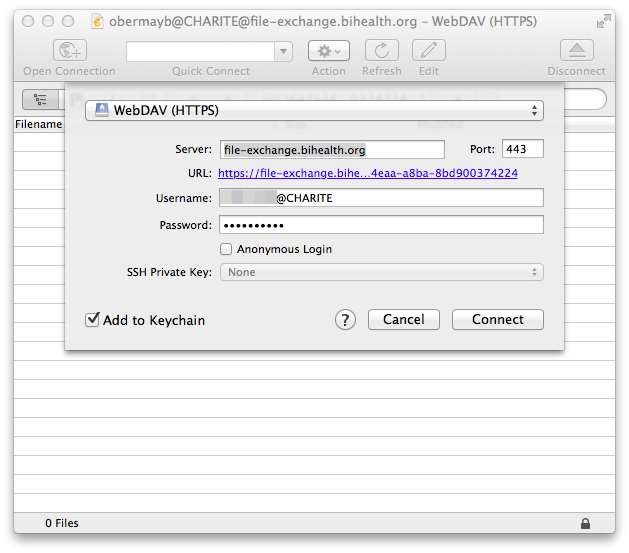

# How-To: Use File Exchange

!!! important "Obtaining File Boxes"

    At the moment, file boxes are only available to members of core facilities (e.g., genomics, bioinformatics, or metabolomics) for exchanging files for their collaboration partners.
    Currently, HPC users **cannot** use the file box mechanism on their own.

BIH HPC IT provides a file exchange server to be used by the BIH core facilities and their users.
The server is located in the BIH DMZ in Buch.
Users authenticate using their Charite/BIH (`user@CHARITE`) or MDC accounts (`user@MDC-BERLIN`).
File exchange is organized using "file boxes", directories created on the server to which selected users are granted access.
Access control list maintenance is done with audit-trails ("Revisionssicherheit") and the file access itself is also logged to comply with data protection standards.

- [Jump to "From Windows"](#from-windows)
- [Jump to "From Linux"](#from-linux)
- [Jump to "From Mac"](#from-mac)

!!! important "Access from Charite Network"

    Access from the Charite network (IP ranges `141.x.x.x` and `10.x.x.x`) must connect through the Charite proxy (`http://proxy.charite.de:8080`).
    Depending on the client software that you are using, you might have to configure the proxy.

## File Box Management

File boxes are created by the core facilities (e.g., the genomics facilities at Charite and MDC).
The facility members also organize the access control.
Please talk to your core facility contact on file exchange.

External users must obtain a Charite or MDC account first.
Account creation is handled by the core facilities that the external user is a customer of.

## File Access

Generally, you will be given a URL to your file box similar to `https://file-exchange.bihealth.org/<file-box-id>`.
The files are served over an encrypted connection using WebDAV (which uses HTTPS).

The following describes how to access the files in the box from different platforms.

### From Linux

We describe how to access the files on the command line using the `lftp` program.
The program is preinstalled on the BIH (and the MDC cluster) and you should be able to just install it with `yum install lftp` on CentOS/Red Hat or `apt-get install lftp` on Ubuntu/Debian.

When using `lftp`, you have to add some configuration first:

```bash
# cat >>~/.lftprc <<"EOF"
set ssl:verify-certificate no
set ftp:ssl-force yes
EOF
```

In case that you want to access the files using a graphical user interface, search Google for "WebDAV" and your operating system or desktop environment.
File browsers such as Nautilus and Thunar have built-in WebDAV support.

#### Connecting

First, log into the machine that has `lftp` installed.
The login nodes of the BIH cluster do not have it installed but all compute and file transfer nodes have it.
Go to the data download location.

```bash
host:~$ mkdir -p ~/scratch/download_dir
host:~$ cd ~/scratch/download_dir
```

Next, start `lftp`.
You can open the connection using `open -u <user>@<DOMAIN> https://file-exchange.bihealth.org/<file-box-id>/` (NB: there is a trailing slash) where

- `<user>` is your user name, e.g., `holtgrem`,
- `<domain>` is either `MDC` or `CHARITE`, and
- `<file-box-id>` the file box ID from the URL provided to you.

When prompted, use your normal Charite/MDC password to login.

```bash
host:download_dir$ lftp
lftp :~> open -u holtgrem@CHARITE https://file-exchange.bihealth.org/c62910b3-c1ba-49a5-81a6-a68f1f15aef6
Password:
cd ok, cwd=/c62910b3-c1ba-49a5-81a6-a68f1f15aef6
lftp holtgrem@CHARITE@file-exchange.bihealth.org:/c62910b3-c1ba-49a5-81a6-a68f1f15aef6>
```

#### Browsing Data

You can find a full reference of `lftp` on the [lftp man page](https://lftp.yar.ru/lftp-man.html).
You could also use `help COMMAND` on the lftp prompt.
For example, to look at the files of the server for a bit...

```bash
lftp holtgrem@CHARITE@file-exchange.bihealth.org:/c62910b3-c1ba-49a5-81a6-a68f1f15aef6> ls
drwxr-xr-x  --  /
drwxr-xr-x  --  dir
-rw-r--r--  --  file1
lftp holtgrem@CHARITE@file-exchange.bihealth.org:/c62910b3-c1ba-49a5-81a6-a68f1f15aef6> find
./
./dir/
./dir/file2
./file1
```

#### Downloading Data

To download all data use `mirror`, e.g. with `-P 4` to use four download threads.

```bash
lftp holtgrem@CHARITE@file-exchange.bihealth.org:/c62910b3-c1ba-49a5-81a6-a68f1f15aef6> mirror .
Total: 2 directories, 3 files, 0 symlinks
New: 3 files, 0 symlinks
lftp holtgrem@CHARITE@file-exchange.bihealth.org:/c62910b3-c1ba-49a5-81a6-a68f1f15aef6> exit
host:download_dir$ tree
.
├── dir
│   └── file2
├── file1
└── file.txt

1 directory, 3 files
```


!!! info "Ignoring `gnutls_record_recv` errors."

    A common error to see is `mirror: Fatal error: gnutls_record_recv: The TLS connection was non-properly terminated.`.
    You can just ignore this.

#### Uploading Data

To upload data, you can use `mirror -R .` which is essentially the "reverse" of the mirror command.

```bash
lftp holtgrem@CHARITE@file-exchange.bihealth.org:/c62910b3-c1ba-49a5-81a6-a68f1f15aef6> mirror -R
mirror: Fatal error: gnutls_record_recv: The TLS connection was non-properly terminated.
mirror: Fatal error: gnutls_record_recv: The TLS connection was non-properly terminated.
mirror: Fatal error: gnutls_record_recv: The TLS connection was non-properly terminated.
Total: 2 directories, 3 files, 0 symlinks
Modified: 3 files, 0 symlinks
4 errors detected
```

### From Windows

We recommend to use WinSCP for file transfer.

- **Pre-packaged WinSCP on Charite Workstations.**
  Charite IT has packaged WinSCP and you can install it using Matrix24 Empirum on Windows 10 [using these instructions in the Charite intranet](https://intranet.charite.de/fileadmin/user_upload/portal/service/service_06_geschaeftsbereiche/service_06_14_it/a-software-selbst-installieren.pdf).
- **Installing WinSCP yourself.**
  You can obtain it from the [WinSCP Download Page](https://winscp.net/eng/downloads.php).
  A "portable" version is available that comes as a ZIP archive that you just have to extract without an installer.

### Connecting

After starting WinSCP, you will see a window titled `Login`.
Just paste the URL (e.g., `https://file-exchange.bihealth.org/c62910b3-c1ba-49a5-81a6-a68f1f15aef6/`) of the file box into the `Host name` entry field.
In this case, the fields `File protocol` etc. will be filled automatically.
Next, enter your user name as `user@CHARITE` or `user@MDC-BERLIN` (the capitalization of the part behind the `@` is important).
The window should now look similar to the one below.



!!! important "Proxy Configuration on Charite Network"

    **If you are on the Charite network then you have to configure the proxy.**
    **Otherwise, you have to skip this step.**

    Click `Advanced` and a window titled `Advanced Site Settings` will pop up.
    Here, select `Connection / Proxy` in the left side.
    Select `HTTP` for the `Proxy type`.
    Then, enter `proxy.charite.de` as the `Proxy host name` and set the `Port number` to `8080`.
    The window should nwo look as below.
    Then, click `OK` to apply the proxy settings.

    

Finally, click `Login`.
You can now transfer files between the file exchange server and your local computer using drag and drop between WinSCP and your local Windows File Explorer.
Alternatively, you can use the two-panel view of WinSCP to transfer files [as described here](https://winscp.net/eng/docs/guide_upload).

### From Mac

For Mac, we you can also use `lftp` as described above in [From Linux](#from-linux).
You can find install instructions [here online](http://macappstore.org/lftp/).

!!! important "Proxy Configuration on Charite Network"

    **If you are on the Charite network then you must have configured the proxy appropriately.**
    **Otherwise, you have to skip this step.**

    You can find them in your `System Preference` in the `Network` section, in the `Advanced` tab of your network (e.g., `WiFi`).
    

If you want to use a graphical interface then we recommend the usage of [Cyberduck](https://cyberduck.io/).
After starting the program, click `Open Connection` on the top left, then select `WebDAV (HTTPS)` and fill out the form as in the following way.
Paste the file box URL into the server field and use your login name (`user@CHARITE` or `user@MDC-BERLIN`) with your usual password.



If you need to perform access through a graphical user interface on your Mac, please contact hpc-helpdesk@bihealth.org for support.

## Security

The file exchange server has the `fail2ban` software installed and configured (Charite, MDC, and BIH IPs are excluded from this).

If you are entering your user/password incorrectly for more than 5 times in 10 minutes then your machine will be banned for one hour.
This means someone else that has the same IP address from the side of the file exchange server can get you blocked.
This can happen if you are in the same home or university network with NAT or if you are behind a proxy.
In this case you get a "connection refused" error.
In this case, try again in one hour.


