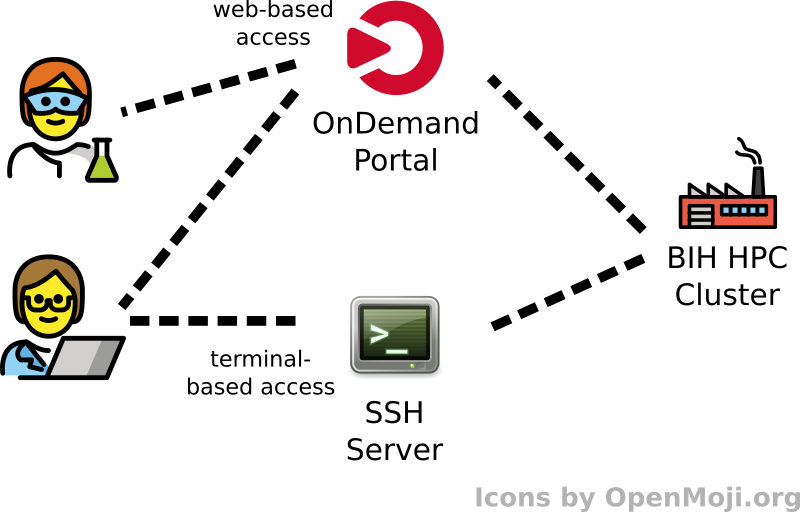
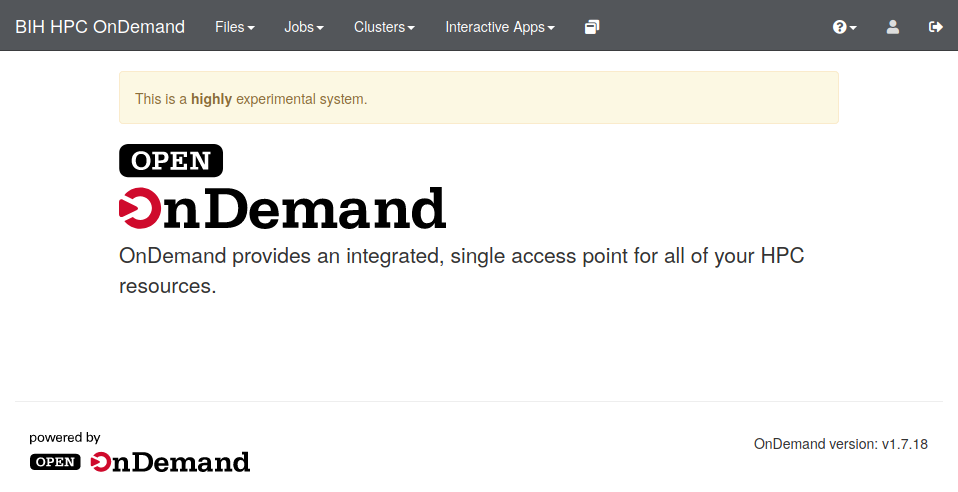

# The Open OnDemand Portal

!!! important "Status / Stability"

    OnDemand Support is currently in **beta** phase on the BIH HPC.
    In case of any issues, please send an email to hpc-helpdesk@bihealth.de.

To allow for better interactive works, BIH HPC administration has setup an  [Open OnDemand (OOD)](https://openondemand.org/) portal web server.

- https://portal.research.hpc.bihealth.org

## Background

OOD allows you to access cluster resources using a web-based graphical interface in addition to traditional SSH connections.
You can then connect to jobs running graphical applications either to virtual desktops (such as Matlab) or to web apps (such as Jupyter and RStudio Server).

The following figure illustrates this.

{: style="width:60%;" .center}

The primary way to the cluster continues to be SSH which has several advantages.
By the nature of the cluster being based on Linux servers, it will offer more features through the "native" access and through its lower complexity, it will offer higher stability.
However, we all like to have the option of a graphical interface, at least for time to time :tv:.

The main features are:

- **Easy web-based access to Jupyter and RStudio Server on the cluster.**
- Generally lower the entry barrier of using the HPC system.

## Logging into the Portal

The first prerequisite is to have a cluster account already (see [Getting Access](/admin/getting-access/)).
Once you have done your first SSH connection to the cluster successfully you can start using the portal.
For this you perform the following steps:

1. Go to https://portal.research.hpc.bihealth.org - you will be redirected to the login page shown below.
   If you have an account with Charite (ends in `_m`) then please use the "Charité - Universitätmedizin Berlin" button, for MDC Accounts please use the "Max Delbrück Center Berlin" button.

    {: style="width:30%;" .center}
2. Login with your home organization's SSO system.
   Please note that depending on whether you are accessing the system via the wired network in your home organization or via VPN the SSO might look differently.

    !!! help "Clicked the Wrong Login Button?"

        If you clicked the wrong button then please clear your cookies to force a logout of the system.

## Portal Dashboard

!!! help "Problems with Open OnDemand?"

    First try to log out and login again.
    Next, try to clear all cookies for the domain `portal.research.hpc.bihealth.org`.
    Finally, try the `Help > Restart Web Server` link to restart the per-user nginx (PUN) server.

You will then be redirected to the dashboard screen.

{: style="width:60%;" .center}

Here you have access to the following actions.
We will not go into detail of all of them and expect them to be self-explanatory.

!!! important

    Please note that when using the portal then you are acting as your HPC user.
    Use standard best practice.
    Consider carefully what you do as you would from the command line (e.g., don't use the portal to browse the web from the cluster).

- **Files** - access a file browser
    - **Quotas** - display quota information.
- **Jobs** - list your jobs or start a new one
- **Clusters** - shell access in your browser
- **Interactive Apps**
    - **Mate and Xfce Desktops** - start virtual desktops on the HPC.
    - **Matlab** - run a virtual desktop that has Matlab installed.
    - **MaxQuant** - run a virtual desktop that has MaxQuant installed
    - **Jupyter** - run Jupyter on the HPC and easily connect to it from your browser without setting up any SSH tunnels
    - **RStudio Server** - run RStudio Server on the HPC and easily connect to it from your browser without setting up any SSH tunnels
- **My Interactive Sessions** - see details of your currently running interactive sessions
- **Help**
    - **Online Documentation** - links to this documentation.
    - **Contact Support** - links ot the "Getting Help" page in this documentation.
    - **Restart Web Server** component. Try this if the portal acts weird before contacting the helpdesk. OnDemand runs a web server per user, so this does not affect any other user.
- **Log Out** - log out of the system.

## Interactive Sessions

The interactive session list is the most interesting one so we will explain it in a bit more detail.

{: style="width:90%;" .center}

Each running interactive session is listed.
For each, the following links are available:

- **Host** - click on the host name to open a shell to the given cluster node
- **Session ID** - open the session directory (also see below).
- **Connect to** button - this will open the app in your browser (opens a new tab).

!!! important "Don't hit reload in your apps"

    Please note that the portal will use the authentication mechanisms of the apps to ensure that nobody except for you can connect to the session.
    This means that hitting the browsers "reload" button in your app will most likely not work.

    Just go back to the interactive session list and click on the "connect" button.

## Session Directories

The portal software will create a folder `ondemand` in your home directory.
Inside, it will create session directories for each started interactive job.
For technical reasons, these folders have very long names, for example:

- `$HOME/ondemand/data/sys/dashboard/batch_connect/sys/ood-bih-rstudio-server/output/e40e03b3-11ca-458a-855b-98e6f148c99a/`

This follows the pattern:

- `$HOME/${application name}/output/${job UUID}`

The job identifier used is **not** the Slurm job ID but an identifier internal to OnDemand.
Inside this directory you will find log files and a number of scripts that are used to start your job.

If you need to debug any interactive job, start here.
Also, the helpdesk will need the path to this folder to help you with interactive jobs.

You can find the name of the latest output folder with the following command:

```bash
$ ls -lhtr $HOME/${application name}/output | tail -n 1
```

For example, for RStudio Server:

```bash
$ ls -lhtr $HOME/ondemand/data/sys/dashboard/batch_connect/sys/ood-bih-rstudio-server/output | tail -n 1
```

!!! important "Prevent Home From Filling Up"

    You should probably move `~/ondemand` to your work volume with the following:

    ```bash
    $ mv ~/ondemand ~/work/ondemand
    $ ln -sr ~/work/ondemand ~/ondemand
    ```

    Also, clear out `~/work/ondemand/*` from time to time but take care that you don't remove the directory of any running job.
