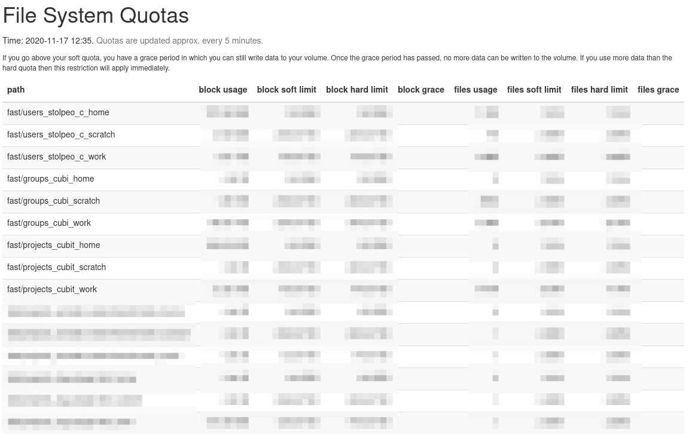

# OnDemand: Quota Inspection

Accessing the quota report by selecting `Files` and then `Quotas` in the top menu
will provide you with a detailed list of all quotas for directories that you are assigned to.

{: style="width:90%;" .center}

There are two types of quotas: for (a) size of and (b) number of files in a directory.

Every row in the table corresponds to a directory that you have access to. This implies
your home directory (`fast/users`) as well as the group directory of your lab (`fast/groups`) and possible projects (`fast/projects`)
(if any). Quotas are not directly implied on these directories but on the `home`, `scratch` and `work`
subdirectories that each of subdirectory of the beforementioned directories has (for a detailed explanation see [Storage and Volumes](../storage-locations)).

The following list explains the columns of the table:

- **path** resembles the path to the directory the quota is displayed for.
Please note that this is not actually a path but the fileset name the
cluster uses internally to handle the associated directory/path. The "real" path
can be derived by preceding the name with a slash (`/`) and substituting the
underscores with a slash in the `(users|groups|projects)_` and `_(home|scratch|work)` substring.
The corresponding path for name `fast/users_stolpeo_c_home` would be `/fast/users/stolpeo_c/home`.
- **block usage** gives the current size of the directory/fileset. The unit is
variable and directly attached to the number.
- **block soft limit** gives the soft quota for the directory/fileset. Exceeding
the soft quota (and staying below the hard quota) will trigger the grace period.
The unit is variable and directly attached to the number.
- **block hard limit** gives the hard quota for the directory/fileset. Exceeding
the hard quota is not possible and will prevent you from writing any data to the
directory. That might cause trouble even deleting files as logging in and browsing
the file system may create data. The unit is variable and directly attached to the number.
- **block grace** gives the grace period in days when exceeding the soft quota.
- **files usage** gives the number of files in the directory tree.
- **files soft limit** gives the soft quota for the allowed number of files in
the directory/fileset. Exceeding the soft quota (and staying below the hard quota)
will trigger the grace period.
- **files hard limit** gives the hard quota for the allowed number of files.
Exceeding the hard quota is not possible and will prevent you from writing any data to the
directory. That might cause trouble even deleting files as logging in and browsing
the file system may create data.
- **files grace** gives the grace period in days when exceeding the soft quota for files.
